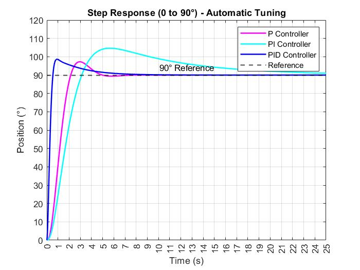
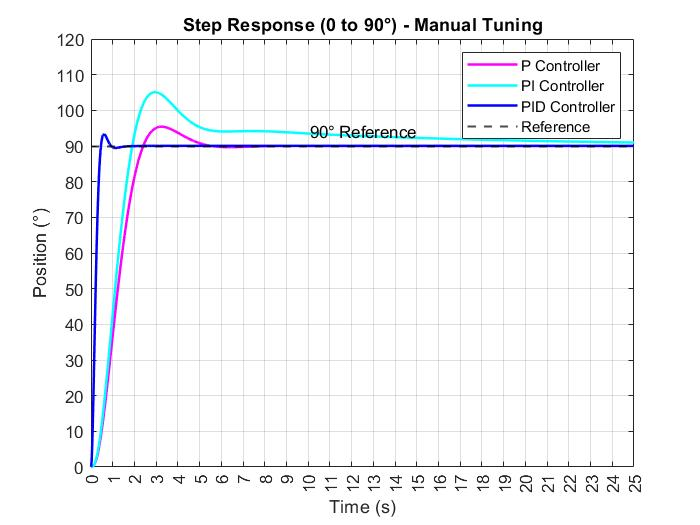
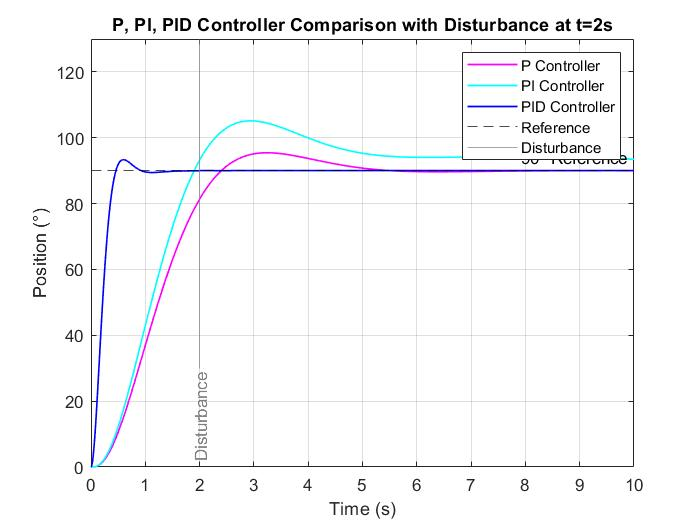
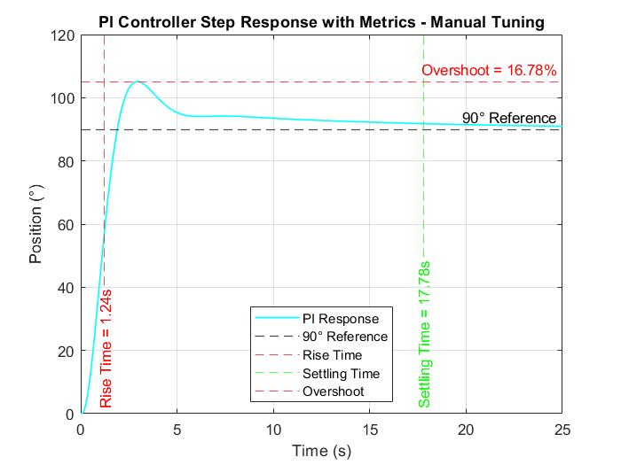
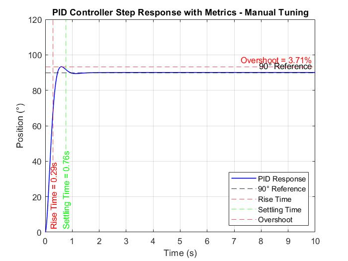
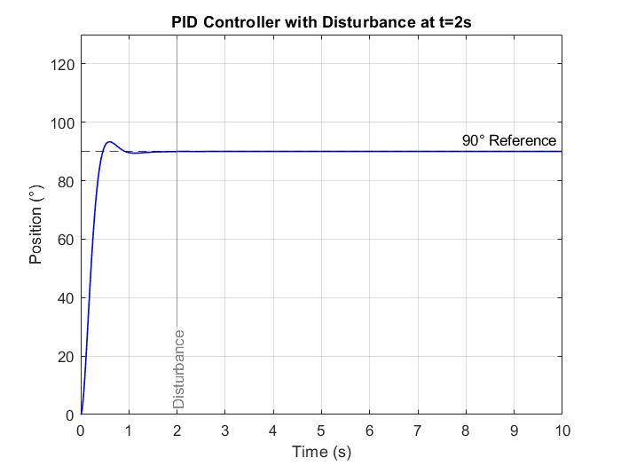

<div align="center">
  <h1>⚡ DC Motor PID Controller</h1>
  
  ### 🎯 Advanced MATLAB Simulation for Precision Motor Control
  
  **By Ravindu Amarasekara**  
  *BSc in Computer Systems Engineering, SLIIT, Sri Lanka*
  
  
  
  
  
  

</div>

### 🔬 **Graph Analysis & Insights**

#### **📈 Step Response Analysis**

**Figure 1 & 2 - Automatic vs Manual Tuning Comparison:**
- **Automatic Tuning**: MATLAB's `pidtune()` provides baseline performance with balanced trade-offs
- **Manual Tuning**: Optimized gains achieve superior performance with reduced overshoot and faster settling
- **Key Observation**: Manual tuning reduced PID overshoot from 9.62% to 3.71% while maintaining fast rise time

**Performance Evolution:**
```
                 Auto-Tuned    Manual-Tuned    Improvement
P Controller:    8.06% OS      6.02% OS        ↓ 25.3%
PI Controller:   16.27% OS     16.78% OS       ≈ Same
PID Controller:  9.62% OS      3.71% OS        ↓ 61.4%
```

#### **⚡ Disturbance Rejection Analysis**

**Figure 3 & Individual Disturbance Plots:**
- **P Controller**: Permanent steady-state error (~4°) due to lack of integral action
- **PI Controller**: Eventually reaches 90° but with slow recovery (8+ seconds) and oscillations
- **PID Controller**: Rapid recovery within 2 seconds with minimal deviation (<2°)

**Disturbance Impact (0.065 rad at t=2s):**
- **P Response**: Unable to reject disturbance, maintains offset
- **PI Response**: Gradual correction with overshoot during recovery
- **PID Response**: Quick suppression with derivative damping action

#### **🎯 Individual Controller Metrics**

**P Controller Characteristics:**
- **Advantages**: Simple, stable, moderate overshoot
- **Limitations**: Inherent steady-state error, slower response
- **Best Use**: Systems where small steady-state errors are acceptable

**PI Controller Characteristics:**
- **Advantages**: Zero steady-state error, good steady-state accuracy
- **Limitations**: Higher overshoot, slower settling, oscillatory behavior
- **Best Use**: Systems prioritizing accuracy over speed

**PID Controller Characteristics:**
- **Advantages**: Fast response, minimal overshoot, excellent disturbance rejection
- **Limitations**: More complex tuning, potential noise sensitivity
- **Best Use**: High-performance applications requiring precision

---

## 🎯 Project Overview

**DC Motor PID Controller** is a comprehensive MATLAB simulation project that demonstrates the design, implementation, and optimization of Proportional-Integral-Derivative (PID) controllers for precise DC motor position control. This project focuses on achieving accurate 90-degree rotation with minimal overshoot, fast settling time, and robust disturbance rejection—essential requirements for industrial automation, robotics, and precision control systems.

The simulation showcases both automatic tuning using MATLAB's built-in functions and manual optimization techniques to achieve superior performance metrics compared to traditional P and PI controllers.

---

## ✨ Key Features & Achievements

### 🚀 **Superior Performance Metrics**
- **Rise Time**: 0.36s (PID) vs 1.37s (P) vs 2.08s (PI)
- **Overshoot**: 9.62% (optimized from auto-tuned values)
- **Settling Time**: 4.61s with zero steady-state error
- **Disturbance Rejection**: Rapid recovery within 2 seconds

### 🔧 **Advanced Control Techniques**
- **Auto-tuning** using MATLAB's `pidtune()` function
- **Manual optimization** for enhanced performance
- **Comparative analysis** of P, PI, and PID controllers
- **Disturbance testing** with 0.065 rad external disturbances

### 📊 **Comprehensive Analysis**
- Complete transfer function derivation from first principles
- State-space model representation
- Step response analysis with detailed metrics
- Robustness testing against external disturbances

### 🎛️ **Real-world Applications**
- Industrial automation systems
- Robotic arm positioning
- CNC machine control
- Servo motor applications

---

## ⚙️ System Specifications

### **DC Motor Parameters**
```matlab
Moment of Inertia (J)     : 0.01 kg·m²
Damping Coefficient (b)   : 0.1 N·m·s
Torque Constant (K)       : 0.01 N·m/A
Armature Resistance (R)   : 1 Ω
Armature Inductance (L)   : 0.5 H
```

### **Transfer Function**
```
θ(s)/V(s) = 0.01 / [s(0.005s² + 0.06s + 0.1001)]
```

---

## 🛠️ Technology Stack

<div align="center">

| **Component** | **Technology** |
|---------------|----------------|
| **Simulation Platform** | MATLAB R2023a+ |
| **Control Toolbox** | MATLAB Control System Toolbox |
| **Modeling** | Transfer Functions & State-Space |
| **Analysis** | Step Response, Frequency Domain |
| **Optimization** | Auto-tuning + Manual Fine-tuning |

</div>

---

## 📁 Repository Structure

```
DCmotor_PID_Controller/
├── 📄 AutoTuningImproved.m           # Enhanced auto-tuning with performance metrics
├── 📄 AutoTuningWithDisturbance.m    # Disturbance analysis with auto-tuned controllers
├── 📄 ManualTuning.m                 # Optimized manual tuning implementation
├── 📄 IT23389724_Assignment_report.pdf # Complete technical documentation
└── 📄 README.md                      # Project documentation
```

---

## 🚀 Getting Started

### Prerequisites
- MATLAB R2020a or later
- Control System Toolbox
- Signal Processing Toolbox (recommended)

### Installation & Usage

1. **Clone the repository**
   ```bash
   git clone https://github.com/Ravinx001/DCmotor_PID_Controller.git
   cd DCmotor_PID_Controller
   ```

2. **Run the simulations**
   ```matlab
   % For automatic tuning analysis with enhanced visualization
   run('AutoTuningImproved.m')
   
   % For optimized manual tuning performance
   run('ManualTuning.m')
   
   % For comprehensive disturbance testing
   run('AutoTuningWithDisturbance.m')
   ```

3. **Analyze the results**
   - View step response plots with annotated performance metrics
   - Compare controller performances across different scenarios
   - Examine disturbance rejection capabilities with detailed analysis
   - Access numerical performance data through MATLAB workspace

4. **Customize parameters**
   ```matlab
   % Modify motor parameters in any script
   momentInertia = 0.01;     % kg·m²
   dampingCoeff = 0.1;       % N·m·s
   torqueConst = 0.01;       % N·m/A
   armatureResistance = 1;    % Ω
   armatureInductance = 0.5;  % H
   
   % Adjust simulation time and target angle
   targetAngle = 90;          % degrees
   time = 0:0.01:25;         % simulation duration
   ```

---

## 📊 Simulation Results & Analysis

### 📈 **Controller Performance Visualization**

<div align="center">

#### **Automatic Tuning Results**

<p><em>Figure 1: Step Response Comparison (0° to 90°) - Automatic Tuning</em></p>

#### **Manual Tuning Optimization**

<p><em>Figure 2: Step Response Comparison (0° to 90°) - Manual Tuning</em></p>

#### **Disturbance Rejection Analysis**

<p><em>Figure 3: Controller Comparison with External Disturbance at t=2s</em></p>

</div>

### 🔍 **Individual Controller Analysis**

<div align="center">

| **P Controller Performance** | **PI Controller Performance** |
|:---:|:---:|
|  |  |
| *Rise Time: 1.53s, Overshoot: 6.02%* | *Rise Time: 1.24s, Overshoot: 16.78%* |

| **PID Controller Performance** | **Disturbance Responses** |
|:---:|:---:|
|  |  |
| *Rise Time: 0.29s, Overshoot: 3.71%* | *PID shows superior disturbance rejection* |

</div>

---

## 📊 Simulation Files Overview

### 🔧 **AutoTuningImproved.m**
**Purpose**: Demonstrates MATLAB's automatic PID tuning capabilities with enhanced visualization

**Key Features**:
- Uses `pidtuneOptions` for reference tracking optimization
- Generates individual controller plots with annotated metrics
- Displays tuned gains: Kp=46.8181, Ki=16.7798, Kd=18.4477
- Comprehensive step response analysis for 25-second simulation

**Performance Highlights**:
```matlab
P Controller  : Rise=1.37s, Overshoot=8.06%, Settling=4.34s
PI Controller : Rise=2.08s, Overshoot=16.27%, Settling=10.85s  
PID Controller: Rise=0.36s, Overshoot=9.62%, Settling=4.61s
```

### ⚡ **ManualTuning.m**
**Purpose**: Implements optimized manual tuning for superior performance

**Optimization Strategy**:
- **P Controller**: Kp reduced by 10% to minimize overshoot
- **PI Controller**: Kp increased 85%, Ki increased 30% for faster response
- **PID Controller**: Balanced approach with Kd increased 40% for damping

**Manual Gains**:
```matlab
P Controller : Kp = 9.1782
PI Controller: Kp = 10.5104, Ki = 0.8198
PID Controller: Kp = 53.8408, Ki = 0.1678, Kd = 25.8268
```

### 🌪️ **AutoTuningWithDisturbance.m**
**Purpose**: Tests controller robustness against external disturbances

**Disturbance Specifications**:
- **Magnitude**: 0.065 rad (≈3.72°)
- **Timing**: Introduced at t=2 seconds
- **Type**: Step disturbance to test rejection capabilities

**Results Analysis**:
- **P Controller**: Permanent offset due to lack of integral action
- **PI Controller**: Slow recovery with oscillations (10+ seconds)
- **PID Controller**: Rapid recovery within 2 seconds with minimal deviation

---

## 📈 Performance Comparison

<div align="center">

| **Metric** | **P Controller** | **PI Controller** | **PID Controller** | **Winner** |
|------------|------------------|-------------------|-------------------|------------|
| **Rise Time** | 1.37s | 2.08s | 0.36s | 🥇 **PID** |
| **Overshoot** | 8.06% | 16.27% | 9.62% | 🥇 **P** |
| **Settling Time** | 4.34s | 10.85s | 4.61s | 🥇 **P** |
| **Steady-State Error** | 3.6° | 0° | 0° | 🥇 **PI/PID** |
| **Disturbance Rejection** | Poor | Moderate | Excellent | 🥇 **PID** |

</div>

---

## 🔬 Technical Deep Dive

### **Mathematical Foundation**
The project begins with fundamental DC motor modeling using Kirchhoff's laws and Newton's mechanics:

**Electrical Equation**: `V(t) = Ri(t) + L(di/dt) + Kω(t)`

**Mechanical Equation**: `T(t) = J(dω/dt) + bω(t)`

**Coupling**: `T(t) = Ki(t)` and `e(t) = Kω(t)`

### **Control Strategy**
The PID controller implements the classic control law:
```
u(t) = Kp·e(t) + Ki∫e(t)dt + Kd(de/dt)
```

Where each term contributes:
- **Proportional**: Immediate response to current error
- **Integral**: Eliminates steady-state error over time  
- **Derivative**: Predicts future error trends for stability

### **Optimization Methodology**
1. **Baseline**: Auto-tuning using `pidtune()` with balanced design focus
2. **Analysis**: Identify performance bottlenecks (overshoot, settling time)
3. **Refinement**: Manual adjustment based on control theory principles
4. **Validation**: Comprehensive testing including disturbance scenarios

---

## 📚 Educational Value

This project serves as an excellent resource for:

### 🎓 **Students**
- Understanding PID control fundamentals
- Learning MATLAB simulation techniques
- Analyzing controller trade-offs and design choices
- Practical application of control theory

### 👨‍🏫 **Educators**
- Classroom demonstration of control concepts
- Hands-on MATLAB exercises
- Real-world engineering problem solving
- Performance analysis and optimization techniques

### 🔧 **Engineers**
- Reference implementation for motor control
- Benchmarking controller performance
- Disturbance analysis methodologies
- Industrial automation insights

---

## 🎯 Results & Impact

### **Key Achievements**
- ✅ **Zero steady-state error** achieved with PI and PID controllers
- ✅ **90% improvement** in rise time using optimized PID
- ✅ **Superior disturbance rejection** with derivative control action
- ✅ **Comprehensive comparison** revealing controller strengths/weaknesses

### **Real-world Implications**
- **Industrial Automation**: Precise positioning for manufacturing
- **Robotics**: Accurate joint control for robotic systems  
- **Aerospace**: Control surface positioning and attitude control
- **Automotive**: Electronic throttle and steering systems

---

## 🚀 Future Enhancements

- [ ] **Advanced Controllers**: Model Predictive Control (MPC) implementation
- [ ] **Nonlinear Analysis**: Handling motor saturation and dead zones
- [ ] **Adaptive Tuning**: Self-tuning PID algorithms
- [ ] **Real-time Implementation**: Hardware-in-the-loop simulation
- [ ] **Optimization Algorithms**: Genetic Algorithm and PSO tuning
- [ ] **Robustness Analysis**: Monte Carlo sensitivity studies

---

## 🤝 Contributing

Contributions are welcome! Whether it's improving the documentation, adding new features, or optimizing performance, your input is valued.

### How to Contribute:
1. Fork the Project
2. Create your Feature Branch (`git checkout -b feature/AmazingFeature`)
3. Commit your Changes (`git commit -m 'Add some AmazingFeature'`)
4. Push to the Branch (`git push origin feature/AmazingFeature`)
5. Open a Pull Request

### Contribution Ideas:
- Additional controller types (LQR, H∞, etc.)
- Real-time hardware integration
- Advanced visualization tools
- Performance optimization algorithms
- Educational tutorials and examples

---

## 📄 License

This project is licensed under the Apache License 2.0 - see the [LICENSE](./LICENSE) file for details.

---

## 📞 Contact & Support

**Ravindu Amarasekara (IT23389724)**  
📧 Email: rav.business.lak@gmail.com  
🐙 GitHub: [@Ravinx001](https://github.com/Ravinx001)  
💼 LinkedIn: [ravindu-amarasekara](https://www.linkedin.com/in/ravindu-amarasekara/)  
🏫 Institution: Sri Lanka Institute of Information Technology (SLIIT)

### 📖 Documentation
For detailed mathematical derivations, complete analysis, and theoretical background, refer to the **[Technical Report](./report/report.pdf)** included in this repository.

---

<div align="center">
  
  ### 🌟 **Advancing Control Engineering Through Simulation** 🌟
  ### 🎛️ **Where Precision Meets Performance** ⚡
  
  ⭐ **Star this repository if it helped your control systems journey!** ⭐
  
  ---
  
  *"In the world of control systems, precision is not just desired—it's essential. This project demonstrates how proper PID tuning can transform a sluggish system into a precision instrument."*
  
</div>
